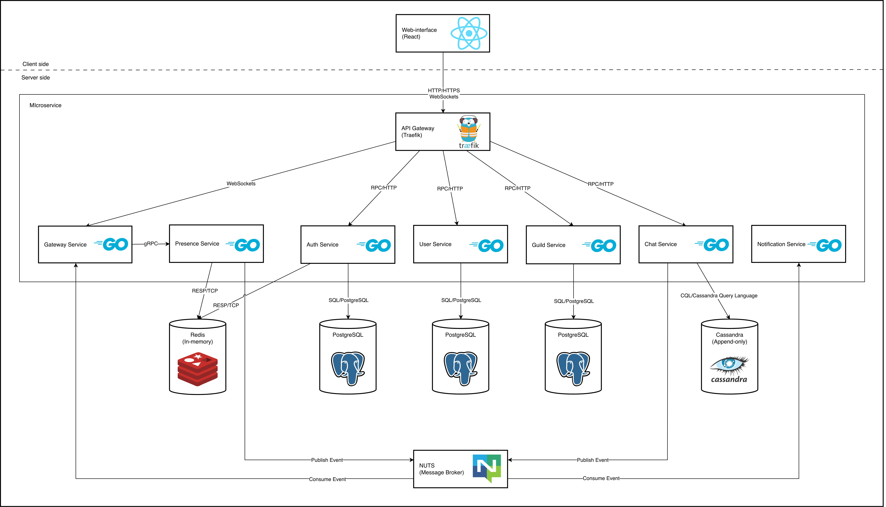

# Minor — Real-time Communication Platform

Minor — это высоконагруженная платформа для общения в реальном времени (аналог Discord) для кафердры НовГУ, построенная на микросервисной архитектуре с использованием Go, React.

## Архитектура системы

### Микросервисы (Go)

- **Auth Service:** Регистрация, авторизация и управление JWT-токенами.
- **User Service:** Управление профилями пользователей и социальными связями (друзья).
- **Guild Service:** Логика серверов (гильдий), каналов и ролей.
- **Chat Service:** Обработка и хранение сообщений чата.
- **Presence Service:** Отслеживание статусов пользователей (Online/Offline, активность) в реальном времени.
- **Notification Service:** Доставка уведомлений (Push, Email).

### Хранение данных и Messaging

- **PostgreSQL:** Основная реляционная БД для пользователей, авторизации и настроек серверов.
- **Cassandra:** Распределенная NoSQL БД для хранения истории сообщений (оптимизирована для записи).
- **Redis:** Быстрое in-memory хранилище для статусов присутствия и кэширования.
- **NATS:** Брокер сообщений для асинхронного взаимодействия между сервисами (Pub/Sub).

## Технологический стек

- **Frontend:** React 19, Vanilla CSS.
- **Backend:** Go (Golang), Chi Router, gRPC.
- **Infrastructure:** Docker, Docker Compose, Traefik.
- **Message Broker:** NATS (JetStream).
- **Databases:** PostgreSQL, Cassandra, Redis.
